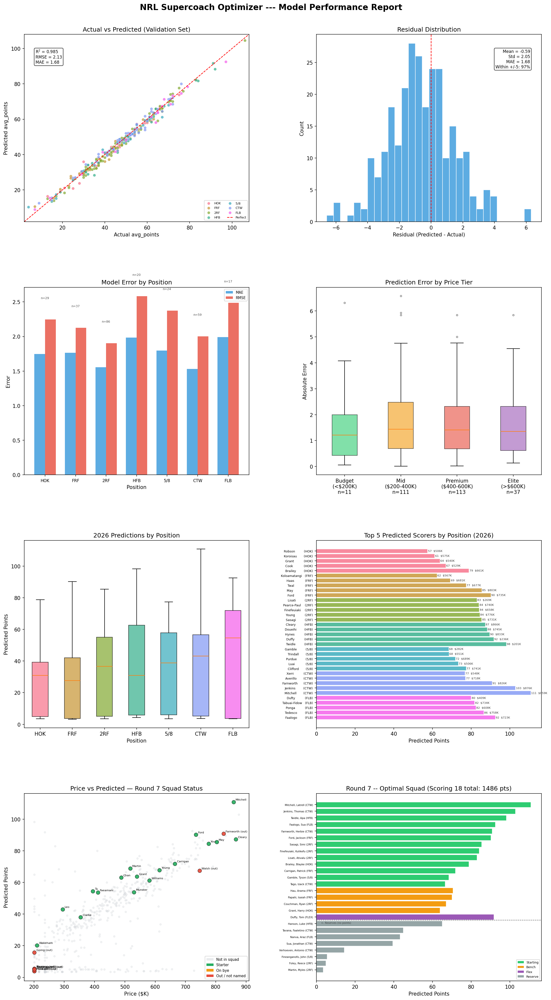

# NRL Supercoach Optimizer

An end-to-end pipeline for the NRL Supercoach fantasy competition: scrapes weekly player stats from [nrlsupercoachstats.com](https://www.nrlsupercoachstats.com), predicts next-round scores with a TensorFlow neural network, and solves a PuLP linear program to pick the optimal 26-player squad under the salary cap.



## Disclaimer

This project scrapes public data from `nrlsupercoachstats.com`. If you fork or run it, **you** are responsible for respecting that site's terms of service and keeping request volume polite (the scraper already uses rotating user-agents, jittered delays, and exponential backoff — don't strip those out). This project is **not** affiliated with the NRL, Fox Sports, or any Supercoach product.

## Features

- **Weekly pipeline** — one command scrapes current stats, merges history, trains/fine-tunes the model, and writes a selected team CSV.
- **Neural-network scoring** — Keras regression over 85+ engineered features (form, price, positional contributions, round-bucket stats, team/position one-hots).
- **Linear-program optimizer** — CBC solver selects the best 26 players under the $11.95 M salary cap, position quotas, team-diversity constraints, and per-round injury exclusions.
- **Pre-season cold start** — when no 2026 games have been played, falls back to historical stats with confidence shrinkage for rookies.
- **Season planner & trade advisor** — simulates all 27 rounds for bye planning, and recommends weekly trades against your current squad.
- **Performance charts** — 8-panel model diagnostic + bye-round analysis rendered to PNG.

## Quick start

```bash
pip install -r requirements.txt
python main.py
```

First run on a clean machine: `python main.py --historical` to bootstrap 2022–2025 cached history (slower, but only needed once).

## Project structure

```
.
├── main.py            # Orchestrates scrape → merge → train → predict → optimize
├── scraper.py         # jqGrid JSON + per-player HTML scraping
├── model.py           # Feature engineering + TF Keras regression
├── optimizer.py       # PuLP linear program for squad selection
├── planner.py         # 27-round simulation + bye / trade scheduling
├── trade_advisor.py   # Weekly trade recommendations vs. your current squad
├── visualise.py       # Matplotlib performance + bye charts
├── requirements.txt
├── data/
│   ├── raw/           # Scraped per-year and per-date CSVs
│   ├── processed/     # Merged master_historical.csv
│   └── rounds/        # Per-round minutes grid, round scores
├── models/            # Persisted .keras model + scaler.pkl + feature_cols.pkl
└── outputs/           # Weekly team CSVs, season_plan.csv, chart PNGs
```

## Algorithms

### Scraper ([scraper.py](scraper.py))

The data source is not HTML tables — it's a **jqGrid JSON endpoint**:

```
GET /stats.php?year=2026&grid_id=list1&jqgrid_page=N&rows=200&sidx=Name&sord=asc
```

- **Pagination** — 527 active players at 200 rows/page → 3 pages for the main roster dump.
- **Per-round snapshots** — same endpoint with `_search=true&searchField=Rd&searchString=N` pulls a given round's scores & minutes.
- **Per-player HTML** — individual player profile pages (`/index.php?player=LastName%2C+FirstName&year=2026`) are parsed with BeautifulSoup to extract the round-by-round chart data embedded in `<script>` tags.
- **Politeness** — 5 rotating user-agents, `random.uniform(0.8, 1.5)` s jitter between requests, exponential 1 s / 2 s / 4 s backoff on retry (max 3 attempts), browser-mimicking `Referer` / `X-Requested-With` headers.
- **Historical caching** — 2022–2025 CSVs are cached under `data/raw/nrl_data_{year}.csv` and skipped on re-runs unless `--rescrape-history` is passed.

The raw API fields (100+) are renamed through `API_COLUMN_MAP` into a clean schema (`player_name`, `team`, `price`, `avg_points`, `points_per_minute`, etc.), and positions are pipe-joined (`"2RF|FRF"`, `"CTW|FLB"`).

### Feature engineering ([model.py](model.py) · `engineer_features`)

The feature matrix has **~85 columns**:

| Group | Count | Examples |
|---|---:|---|
| Numeric (StandardScaler'd) | 54 | `price`, `avg_points`, `avg_last2`, `avg_last3`, `avg_last5`, `points_per_minute`, positional-contribution splits (base / attack / playmaking / evade / negative), round-bucket stats (`R1-9`, `R10-18`, `R19-27`) |
| One-hot positions | 7 | `HOK`, `FRF`, `2RF`, `HFB`, `5/8`, `CTW`, `FLB` |
| One-hot teams | 16 | one per NRL club |
| Derived | 1 | `form_momentum = avg_last3 − avg_last5` |

`price` gets scaled for the NN, but the raw value is preserved as `price_usd` so the LP can enforce the salary cap. Missing values are imputed with position-group median, falling back to global median then zero.

### Neural network ([model.py](model.py) · `load_or_train_model`)

A plain Keras `Sequential` regressor:

```
Dense(128, relu) → Dropout(0.3)
Dense( 64, relu) → Dropout(0.2)
Dense( 32, relu) → Dropout(0.1)
Dense(  1, linear)
```

- **Target** — `avg_points` (unscaled; predictions clipped at 0 on inference).
- **Loss / metrics** — MSE loss, RMSE and MAE reported on a 15 % validation split.
- **Optimizer** — Adam. Learning rate `1e-3` for fresh training, `1e-4` for fine-tuning an existing checkpoint.
- **Schedule** — 100 epochs fresh / 20 epochs fine-tune, batch size 32. `EarlyStopping(patience=7)` and `ReduceLROnPlateau(factor=0.5, patience=3, min_lr=1e-6)` both monitor `val_loss`.
- **Persistence** — trained model at `models/supercoach_model.keras`; scaler at `models/scaler.pkl`; the fitted column list at `models/feature_cols.pkl` so inference uses the exact same feature order as training.

**Pre-season fallback** — when every `avg_points` in the current-year data is 0 (pre-Round-1), the model alone can't score anyone. The pipeline instead:

1. Joins the current roster to the most recent historical season that player appeared in (preferring 2025, falling back to 2024).
2. For rookies with no history, fills stats with the position-group median from historical data.
3. Applies **confidence shrinkage** — predictions for players with fewer than 15 career games are pulled toward the position-group median.
4. Ultimate fallback if no model exists at all: `predicted_points = price_usd / 10000`.

### Linear program ([optimizer.py](optimizer.py) · `select_team`)

The optimizer solves an integer linear program (CBC via PuLP) to pick the squad.

**Decision variables**

| Variable | Domain | Meaning |
|---|---|---|
| `x[i]` | {0, 1} | Player `i` is in the 26-player squad |
| `active[i,p]` | {0, 1} | Player `i` fills a scoring slot in position `p` |
| `reserve[i,p]` | {0, 1} | Player `i` fills a non-scoring reserve slot in position `p` |
| `over_excess[t]` | ℝ₊ | Count of players from team `t` above the soft cap |

**Objective (maximise)**

```
 0.75 · norm(predicted_points) · active_weight
+ 0.20 · diversity_score
+ 0.05 · versatility_score
+ 0.10 · reserve_weight  (for non-scoring reserve picks)
− 0.15 · Σ over_excess[t]
```

- `diversity_score[i] = 1 / team_count[team(i)]`, normalised to [0, 1] — rewards spreading across clubs.
- `versatility_score[i]` counts how many positions the player is eligible for.
- Active slots get weight 1.0; reserves 0.1, so the LP preferentially spends budget on scoring XIII + bench players.

**Constraints**

- **Squad size** — exactly 26 (25 position slots + 1 FLEX).
- **Salary cap** — `Σ price_usd[i] · x[i] ≤ $11,950,000`.
- **Position quotas (hard)** — `HOK=2, FRF=4, 2RF=6, HFB=2, 5/8=2, CTW=7, FLB=2`, plus one FLEX which can fill any position in the scoring XVIII.
- **Active / reserve tiers** — scoring active quotas `HOK=2, FRF=4, 2RF=4, HFB=1, 5/8=1, CTW=4, FLB=1` (+1 FLEX = 18 scoring); reserves `2RF=2, HFB=1, 5/8=1, CTW=3, FLB=1` (= 8 non-scoring).
- **Single slot per player** — each selected player is assigned to exactly one `active` or `reserve` slot.
- **Team diversity** — hard cap `≤ 5` per club (never violated); soft cap `≤ 3` (penalised at 0.15 per excess player via `over_excess[t]`).
- **Injury cover** — for each starting position, at least `quota + 1` selected players must be *eligible* for it (can fill a different slot), guaranteeing bench cover.
- **Injury exclusions** — a hardcoded per-round availability list filters players out pre-solve (e.g. Haas available Round 6, Turpin Round 3, Hunt Round 12).

**Post-solve split** — once the 26 are chosen, a deterministic tiering selects the Starting XIII (1 FLB, 4 CTW, 1 5/8, 1 HFB, 2 FRF, 1 HOK, 3 2RF) from highest-predicted-score eligible players per position, then assigns Bench 4 (1 HOK, 2 FRF, 1 2RF), 1 FLEX, and 8 Reserves.

## Sample output (`outputs/team_round_7.csv`)

Starting XIII for Round 7 (prices and predicted scores from a snapshot run):

```
role,player_name,assigned_position,team,price,predicted_points
Starting,"Brailey, Blayke",HOK,SHA,660900,78.80
Starting,"Ford, Jackson",FRF,NZL,734800,90.16
Starting,"Carrigan, Patrick",FRF,BRO,665300,71.81
Starting,"Sasagi, Simi",2RF,CBR,731300,85.39
Starting,"Finefeuiaki, Kulikefu",2RF,DOL,657800,84.13
Starting,"Lisati, Ativalu",2RF,MEL,269400,82.94
Starting,"Twidle, Apa",HFB,PAR,201400,98.17
Starting,"Gamble, Tyson",5/8,NEW,281600,68.39
Starting,"Mitchell, Latrell",CTW,STH,859000,110.82
Starting,"Jenkins, Thomas",CTW,PTH,876200,102.89
Starting,"Farnworth, Herbie",CTW,DOL,826000,90.76
Starting,"Tago, Izack",CTW,PTH,503600,66.43
Starting,"Faalogo, Sua",FLB,MEL,722800,92.46
```

## CLI reference

`main.py` — the full weekly pipeline:

| Flag | Effect |
|---|---|
| `--year YEAR` | Season year (default: 2026) |
| `--historical` | Bootstrap full player-page history (slow, first run only) |
| `--no-scrape` | Skip scraping; load from `--data` CSV |
| `--rescrape-history` | Force re-scrape of 2024/2025 even if cached |
| `--retrain` | Force full model retrain from scratch (vs. fine-tune) |
| `--round N` | Override auto-detected round number |
| `--plan` | Run season-long bye planner after optimizer |
| `--plan-from-round N` | Start season plan from round N (default: 1) |
| `--data PATH` | CSV to use with `--no-scrape` |

`trade_advisor.py` — weekly trade recommendations:

| Flag | Effect |
|---|---|
| `--no-scrape` | Use existing data instead of scraping fresh |
| `--round N` | Override `CURRENT_ROUND` |
| `--max-trades N` | Max trades to recommend (default: 2) |

`scraper.py`, `model.py`, and `optimizer.py` can also be invoked standalone — each has its own `--help`.

## Known limitations

- The pre-season fallback leans heavily on historical data — rookie predictions will be noisy.
- Pandas emits a cosmetic DataFrame-fragmentation warning during `engineer_features`; it's not functional.
- On Windows PowerShell, Python's `INFO`-level logs go to stderr and the shell reports exit code 1 even on successful runs. The pipeline has succeeded if `outputs/team_round_N.csv` was written.
- Injury / availability list is maintained by hand inside `optimizer.py`; update it each round.
- No unit-test suite yet.

## License

Licensed under the Apache License, Version 2.0. See [LICENSE](LICENSE) for the full text.
